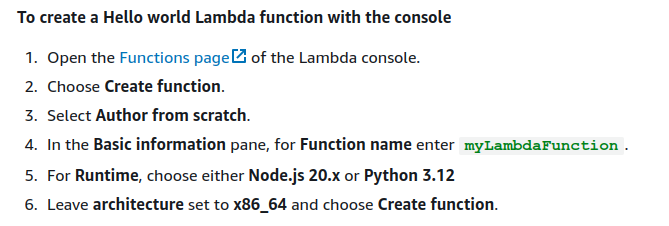

# What is AWS Lambda?

You can use AWS Lambda to run code without provisioning or managing `servers`.

Lambda runs your code on a high-availability compute infrastructure and performs all of the administration of the compute resources, including server and operating system maintenance, capacity provisioning and `automatic scaling`, and `logging`. 

With Lambda, all you need to do is supply your code in one of the language runtimes that Lambda supports.

# When to use Lambda

Lambda is an ideal compute service for application scenarios that need to scale up rapidly, and scale down to zero when not in demand. For example, you can use Lambda for:

- `File processing`: Use Amazon Simple Storage Service (Amazon S3) to trigger Lambda data processing in real time after an upload.

- `Stream processing`: Use Lambda and Amazon Kinesis to process real-time streaming data for application activity tracking, transaction order processing, clickstream analysis, data cleansing, log filtering, indexing, social media analysis, Internet of Things (IoT) device data telemetry, and metering.

- `Web applications`: Combine Lambda with other AWS services to build powerful web applications that automatically scale up and down and run in a highly available configuration across multiple data centers.

- `IoT backends`: Build serverless backends using Lambda to handle web, mobile, IoT, and third-party API requests.

- `Mobile backends`: Build backends using Lambda and Amazon API Gateway to authenticate and process API requests. Use AWS Amplify to easily integrate with your iOS, Android, Web, and React Native frontends.

When using Lambda, you are responsible only for your code. Lambda manages the compute fleet that offers a balance of memory, CPU, network, and other resources to run your code. Because Lambda manages these resources, you cannot log in to compute instances or customize the operating system on provided runtimes. Lambda performs operational and administrative activities on your behalf, including managing capacity, monitoring, and logging your Lambda functions.

## Create your first Lambda function

> Rule: create a permission set that follows the best practice of applying least-privilege permissions.

### To create a Hello world Lambda function with the console

1. Open the Functions page of the Lambda console.

2. Choose `Create function`.

3. Select `Author from scratch`.

4. In the `Basic information` pane, for `Function name` enter `myLambdaFunction`.

5. For Runtime, choose either `Node.js 20.x` or `Python 3.12`

6. eave architecture set to `x86_64` and choose `Create function`.

